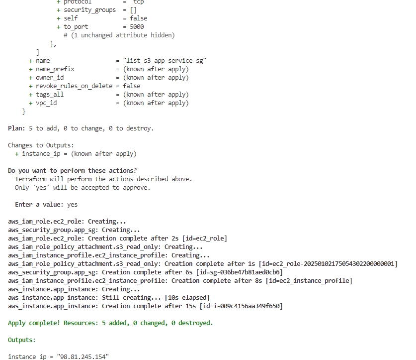
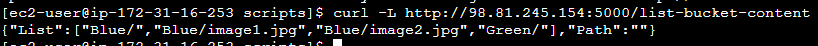
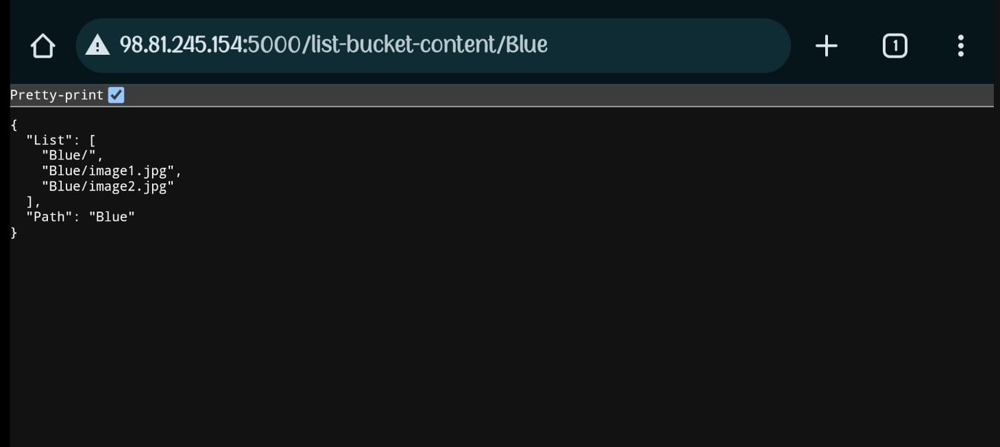
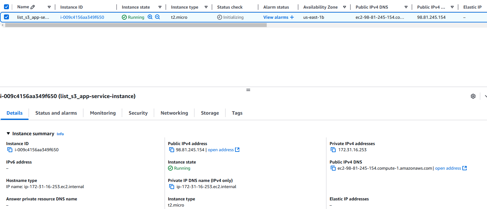
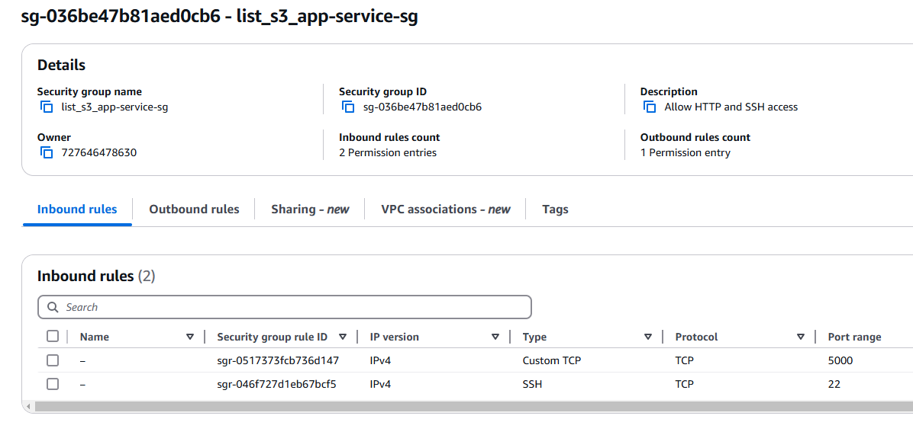
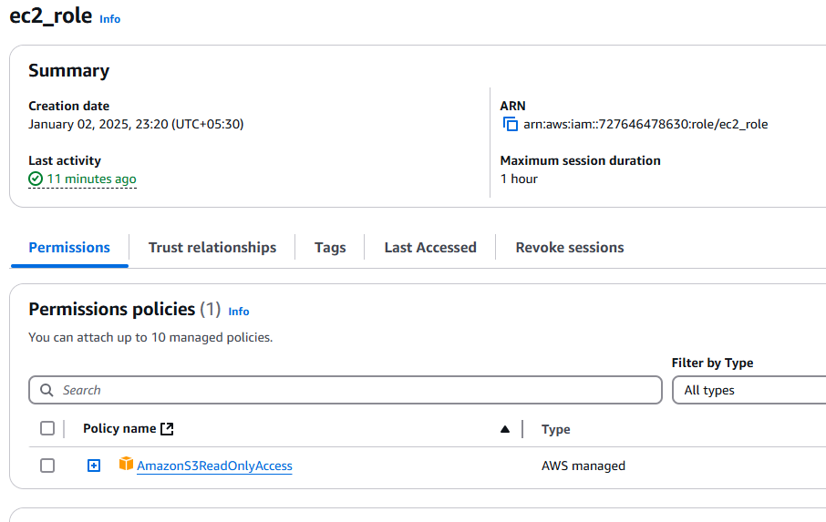
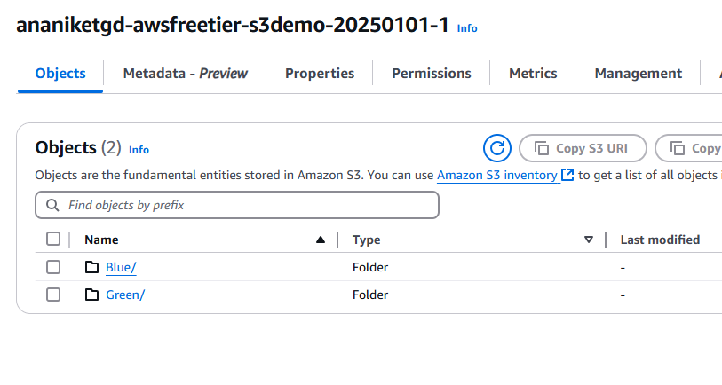

# S3 Bucket Content Listing Service

This is a simple HTTP service implemented in Python using Flask and Boto3. It provides an endpoint to list the content of an AWS S3 bucket at a specified path, and includes a Terraform configuration to provision the necessary AWS infrastructure to run the service.

## Features

- **Flask App**: A Python HTTP service that exposes an endpoint to list the content of an S3 bucket.
- **Terraform Configuration**: Provision AWS infra (EC2, Security Group, IAM Role) to deploy the Flask application.

### Flask App Details

The Flask application exposes the following HTTP endpoint:

- `GET /list-bucket-content/`: Lists the top-level content of the S3 bucket.
- `GET /list-bucket-content/<path>`: Lists the content under a specified path (prefix) in the S3 bucket.

## Prerequisites

### For the Flask Application

- **Python 3.x**: The Python version required for the application.
- **AWS Account**: You need an AWS account with the appropriate permissions to access S3 buckets.

### For Terraform Deployment

- **Terraform**: To provision AWS infrastructure.
- **AWS CLI**: Set up AWS CLI or environment variables (`AWS_ACCESS_KEY_ID`, `AWS_SECRET_ACCESS_KEY`) for authentication.

## Setup

### Step 1: Clone this Repository

Clone the repository to your local machine:

```bash
git clone https://github.com/ADhakephalkar/list_s3_app-service.git
cd list_s3_app-service/scripts
```

### Step 2: Flask Application Setup
#### 2.1 Install Python dependencies
Make sure you have Python 3 and pip installed. Then, install the necessary Python libraries:

```bash
pip install flask boto3
```
#### 2.2 Modify Flask Application (app.py)
In the list_s3_app_service.py file, update the following line with your S3 bucket name:

```python
s3_bucket_name  = 'your-bucket-name'
```

#### 2.3 Run the Flask Application
Start the Flask application:

```bash
python list_s3_app_service.py
```
##### Console Output:


The app will be available at http://localhost:5000. You can use the following endpoints:

#### a. GET /list-bucket-content/
Lists the top-level content in the S3 bucket.

Example Request:

```bash
curl -L http://localhost:5000/list-bucket-content/
```

Example Response:

```json
[
    "Blue/",
    "Blue/image1.jpg",
    "Blue/image2.jpg",
    "Green/"
]
```
##### List Bucket Content


#### b. GET /list-bucket-content/\<path\>
Lists the content under the specified path (prefix) in the S3 bucket.

Example Request:

```bash
curl -L http://localhost:5000/list-bucket-content/Blue
```

Example Response:

```json
[
    "Blue/",
    "Blue/image1.jpg",
    "Blue/image2.jpg"
  ]
```

##### List Bucket Content -> Path


### Step 3: Terraform Setup
The Terraform configuration is used to provision AWS infrastructure (EC2, IAM role, Security Groups) and deploy the Flask application.

#### 3.1 Modify Terraform Variables
In the terraform.tfvars file, update the following variables with your AWS-specific details:

```hcl
aws_region    = "us-east-1"
ami_id        = "ami-xxxxxxxxxxxxxxxxx"  # Your EC2 AMI ID
instance_type = "t2.micro"
```

#### 3.2 Initialize Terraform
This will download the necessary provider plugins.

```bash
terraform init
```

#### 3.4 Plan and Apply Terraform Configuration
Plan the changes:

```bash
terraform plan
```

Apply the configuration:

```bash
terraform apply
```

### Step 4: Access the Flask Application
Once the deployment is complete, Terraform will output the public IP of the EC2 instance. You can access the Flask application by visiting:

```vbnet
http://<public-ip>:5000/list-bucket-content/
```

This will return the contents of the S3 bucket. The service listens on port 5000.

Infrastructure Overview
The following resources will be created:

##### EC2 Instance


##### Security Groups


##### IAM Role


##### S3 Bucket


Clean Up
To destroy the infrastructure created by Terraform, run:

```bash
terraform destroy
```

This will remove the EC2 instance, IAM roles, security groups, and other resources created by Terraform.
